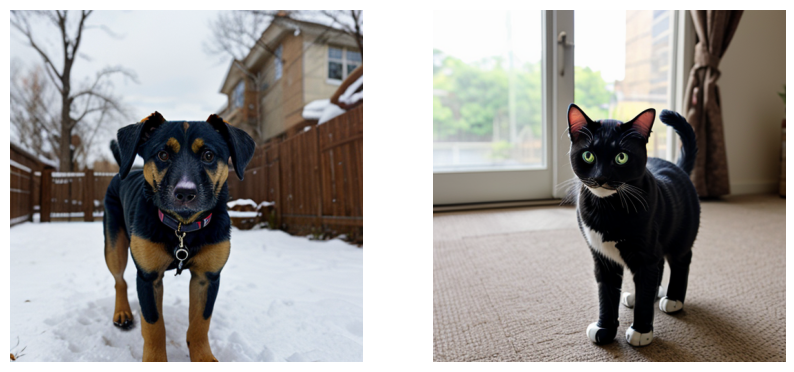
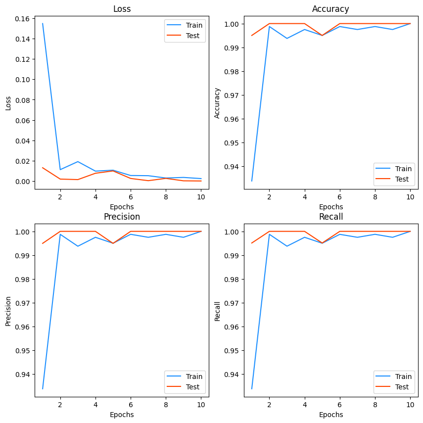
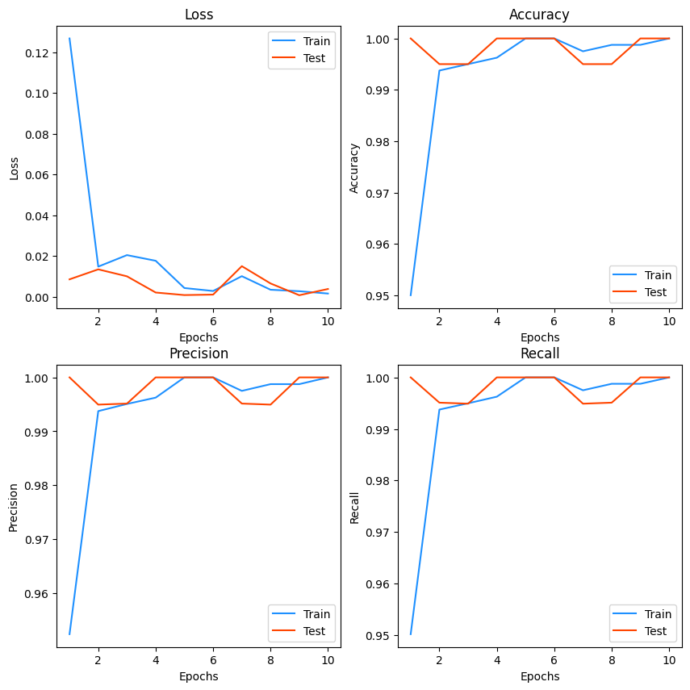
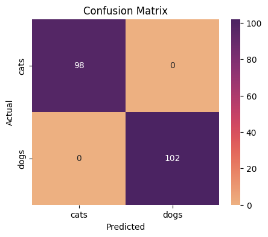
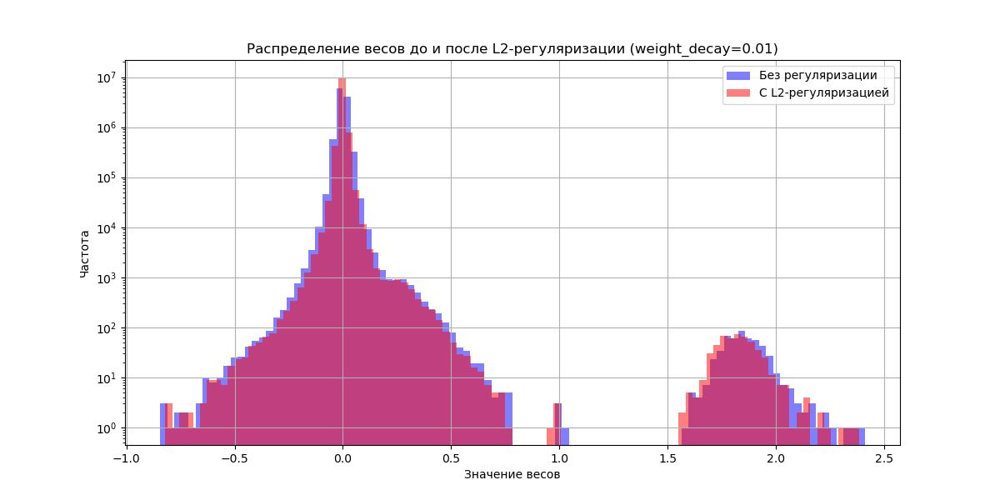
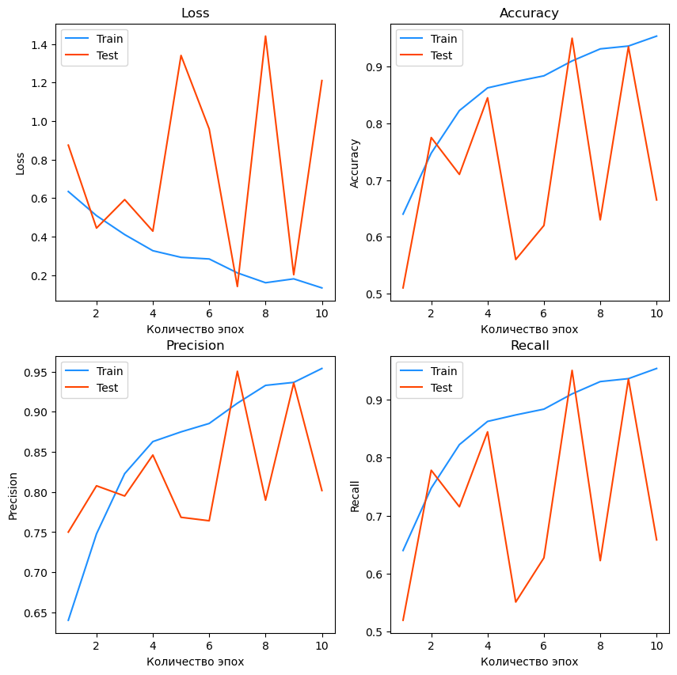
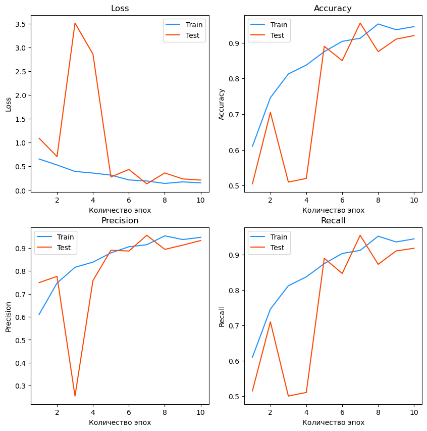

# dog_vs_cat_classification
Сlassification of "Dog vs Cat" dataset reliazed by AnthonyTherrien

Проект по классификации изображений собак и кошек с использованием PyTorch и анализа эффекта L2-регуляризации.

Примеры изображений для классификации:



В проекте использовалась модель ResNet18 с предобученными весами

## Содержание
1. [Особенности](#особенности)
2. [Требования](#требования)
3. [Использование](#использование)
4. [Структура проекта](#структура-проекта)
5. [Результаты](#результаты)
6. [L2 регуляризация](#l2-регуляризация)
7. [Отключение использования предобученных весов](#отключение_использования_предобученных_весов)


## Особенности
- 🖼️ Загрузка датасета через Kaggle Hub  
- 🎛️ Гибкая система аугментаций через YAML-конфиг  
- 🧠 Использование предобученных моделей ResNet  
- 📈 Сравнение моделей с регуляризацией и без  
- 📊 Визуализация метрик и распределения весов  


## Требования
- Python 3.10
- Зависимости:
  ```bash
  pillow>=10.0.0
  torch>=2.0.1
  torchvision>=0.15.2
  numpy>=1.23.0
  tqdm>=4.65.0
  matplotlib>=3.7.0
  scikit-learn>=1.2.2
  seaborn>=0.12.2
  pyyaml>=6.0.1
  kagglehub>=0.2.0            
  ```

## Использование
1. Клонируйте репозиторий:
```bash
git clone https://github.com/Guiuii/dogs-vs-cats-classification.git
cd dogs-vs-cats-classification
```
2. Установите зависимости:
```bash
   pip install -r requirements.txt
```
3. Запустите основной скрипт:
```bash
   python main.py
```
4. Результаты:
   - Метрики для каждой эпохивыводятся в консоль
   - Графики для модели без регуляризации сохраняются в `plots/without_regularization`
   - Графики для модели с L2-регуляризацие1 сохраняются в `plots/with_l2_regularization`


## Структура проекта
```
.
├── config.yaml
├── requirements.txt
├── main.py
├── data_split.py
├── model_construction.py
├── transforms_from_config.py
├── train_and_evaluation.py
├── plots
│   ├── plot_confusion_matrix.py
│   ├── plot_metrics.py
│   ├── weights_distribution.py
│   ├── with_l2_regularization
│   │   ├── confusion_matrix.png
│   │   └── metrics_plot.png
│   └── without_regularization
│       ├── confusion_matrix.png
│       └── metrics_plot.png
├── illustrations
│   ├── example_of_images.png
│   ├── Before_regularization_metrics.png
│   ├── After_regularization_metrics.png
└──  notebook.ipynb
```

## Результаты

- Визуализация графиков зависимости Loss, Accuracy, Precision, Recall от количества эпох для модели без регуляризации
  


- Визуализация графиков зависимости Loss, Accuracy, Precision, Recall от количества эпох для модели с L2-регуляризацией
  


- Confusion matrix для модели без регуляризации
  


- Confusion matrix для модели с L2-регуляризацией
  


## L2 регуляризация

Также выполнена визуализация изменения весов без регуляризации и после применения L2-регуляризации.

После добавления регуляризации можно заметить следующие изменения:
- Веса имеют меньшую дисперсию
- Большие веса становятся меньше, а распределение весов становится более сосредоточенным вокруг нуля



## Отключение использования предобученных весов

В качестве эксперимента было проведено обучение и тестирование модели ResNet18 без использование предобученных весов

Как и ожидалось, при обучения на 10 эпохах метрики сильно колеблются от эпохи к эпохе. Модель не успела обучиться, и отнесла 67 кошечек из 98 к собачкам.



При использовании L2 регуляризации на модели ResNet18 без предобученных весов метрики выглядят более стабильными, однако модель все еще не достаточно хорошо классифицирует картинки после обучения на 10 эпохах. Модель отнесла 16 кошечек из 98 к собачкам. таким образом, просто добавление L2-регуляризации к модели значительно улучшило предсказательную способность модели.


